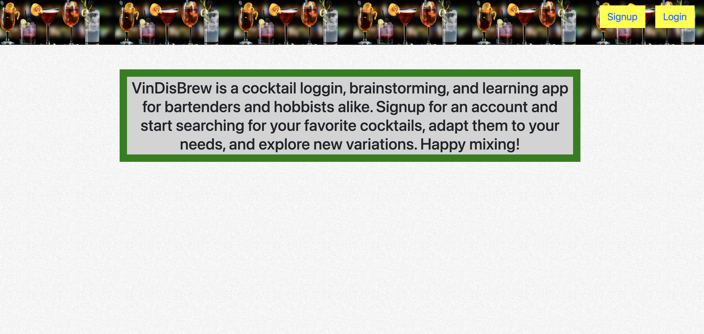
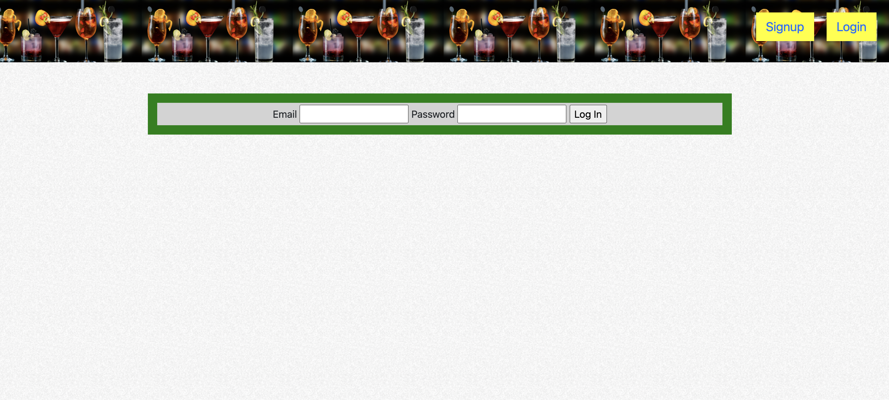
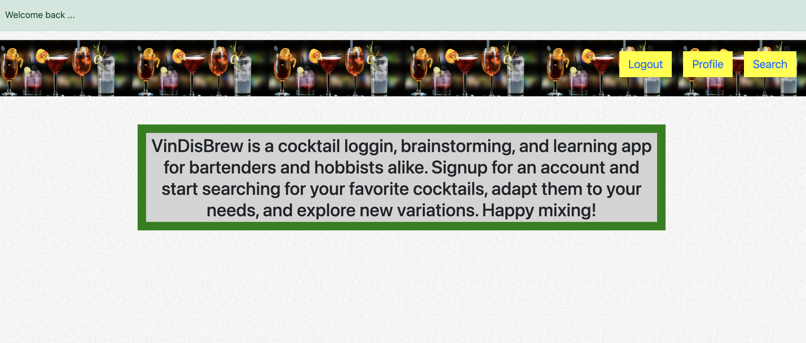
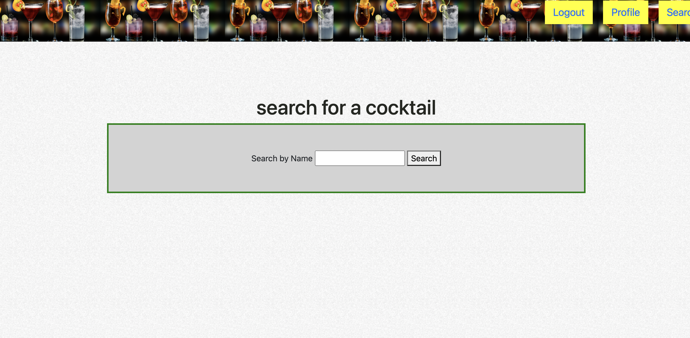
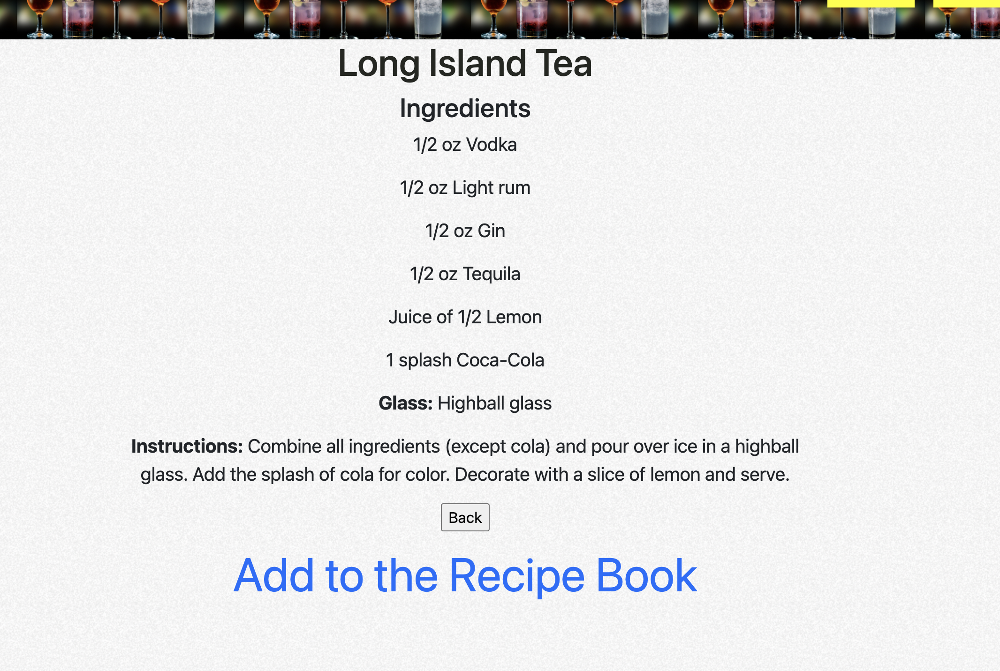
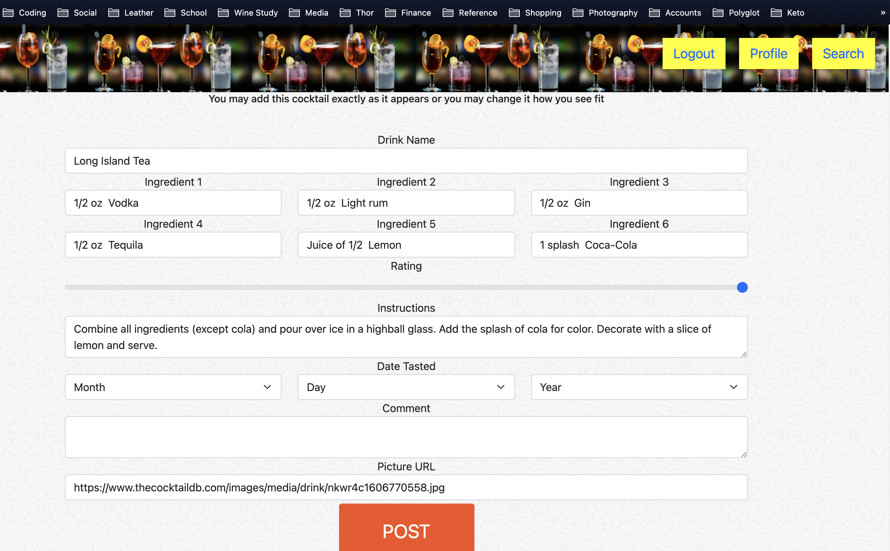
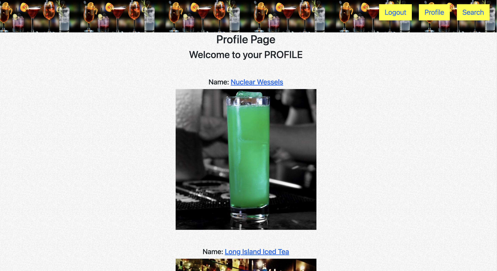
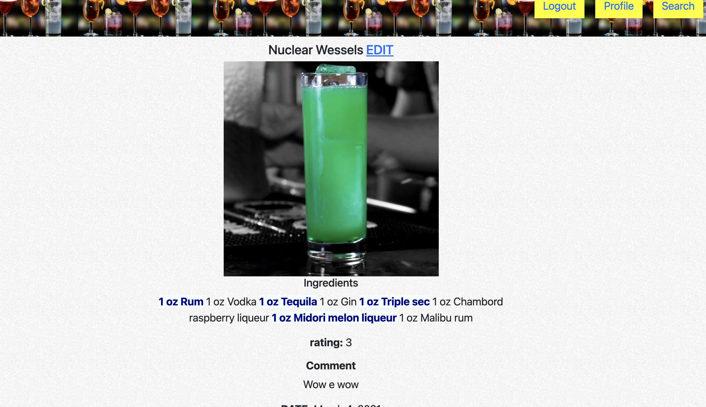
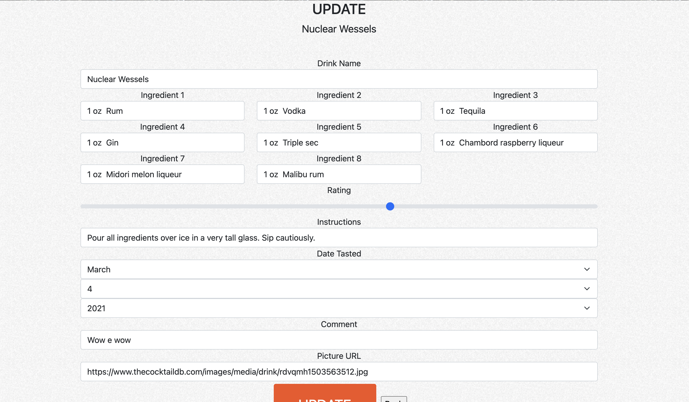

# VinDisBrew

## About

VinDisBrew is a cocktail loggin, brainstorming, and learning app for bartenders and hobbists alike. Signup for an account and start searching for your favorite cocktails, adapt them to your needs, and explore new variations. Happy mixing!

## Access

There are two ways to access VinDisBrew

- The deployed website on [Heroku](https://vindisbrew.herokuapp.com/)
- Through this repository

  - To utilize this repository, perform the following instalation instructions

    1. fork and clone this repo
    2. In the terminal
       1. $ npm install
       2. $ createdb vindisbrew_dev
       3. $ echo "node_modules/" >> .gitignore
       4. $ sequelize db:migrate
    3. go to [the cocktail db](https://rapidapi.com/thecocktaildb/api/the-cocktail-db) and sign up for a host key
    4. create a .env file
    5. In the file add
       - RAPID_API_KEY= 
         RAPID_API_HOST= 
         SECRET_SESSION=shhhhh
       - add your api key and api host to the .env file

    This should open your code and you should be able to use the app.

## Use Instructions

### When you reach the app, you will have two options

- login
  - A current user
- signup
  - A new user

### Go ahead and pic whichever option is appropriate for you. You will then be taken to the welcome page. From here and for the rest of the app, as long as you are logged in, you will have the following options

- search

  - will take the user to the search engine to find a list of cocktails

- profile
  - will take the user to their profile page which will list all of their added cocktails
- logout
  - will log the user out

### By routing to the search engine, you can browse the cocktails according to your parameters and also add cocktials to your list

### From the profile page, you can browse the cocktails you have added to your profile. You can also edit and delete them as well

